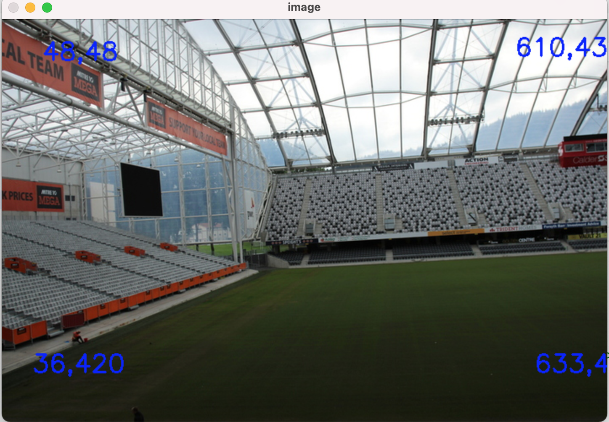
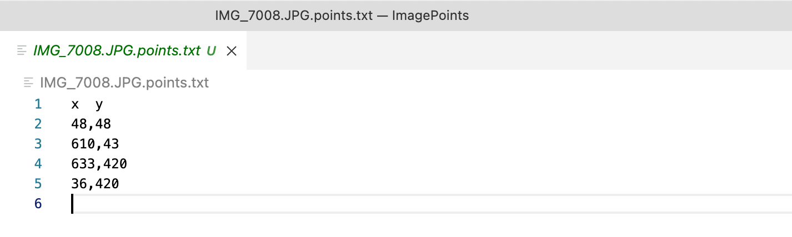

# Camera-Pose-Reprojection

Camera-Pose-Reprojection is a computer vision tool for projecting 3D points into 2D images using camera pose data and calculating reprojection error against manually selected 2D image points. It also identifies outliers based on distance thresholds.
The repository contains two closely related components:

The repository contains two closely related components:

1. **2D Point Annotation**: an Python tool for selecting image points.
2. **ImagePoints**: a C++ application that loads 2D/3D points, camera poses, and COLMAP reconstruction data, projects 3D points into the image, and calculates Euclidean reprojection error.

The two components are kept in the same repository because the 2D annotation output is used by the C++ evaluation program.

## Repository Structure

```text
ProjectPoints/
├── CMakeLists.txt
├── README.md
├── requirements.txt
├── .gitignore
│
├── include/
│   ├── CommandLine.hpp
│   ├── FileIO.hpp
│   ├── Lines.hpp
│   └── Matrix.hpp
│
├── src/
│   ├── ImagePoints.cpp
│   └── utils/
│       ├── FileIO.cpp
│       ├── Lines.cpp
│       └── Matrix.cpp
│
├── tools/
│   └── generate_2d_points.py
│
├── docs/
│   └── images/
│       ├── Input.png
│       └── output.png
│
└── data/                    # local experiment data, not committed
    ├── rgb/
    ├── 2dPoints/
    ├── 3dPoints/
    ├── sparse/
    ├── database.db
    └── poses_esac_.txt
```

## 1. Requirements

### C++

The C++ component requires:

- C++17 compatible compiler
- CMake 3.16 or newer
- Eigen3
- OpenCV
- SQLite3

### Python

The 2D point annotation tool requires:

- Python 3
- OpenCV for Python

Install the Python dependency with:

```bash
python3 -m pip install -r requirements.txt
```

## 2. Dataset Layout

The C++ application expects a dataset directory containing the image data, generated points, COLMAP reconstruction, and pose file.

A typical dataset looks like:

```text
my_dataset/
├── rgb/
│   ├── 1.JPG
│   ├── 2.JPG
│   └── ...
├── 2dPoints/
│   ├── 1.JPG.2dpoints.txt
│   ├── 2.JPG.2dpoints.txt
│   └── ...
├── 3dPoints/
│   ├── 1.JPG.3dpoints.txt
│   ├── 2.JPG.3dpoints.txt
│   └── ...
├── sparse/
│   ├── cameras.txt
│   ├── images.txt
│   └── points3D.txt
├── database.db
└── poses_esac_.txt
```

Before running `ImagePoints`, you need:

- 2D points
- 3D points
- camera pose data
- COLMAP reconstruction data

## 3. Generate 2D Points

Place the input images in a directory such as:

```text
data/rgb/
```

Run:

```bash
python3 tools/generate_2d_points.py
```

By default, the generated files are saved to:

```text
data/2dPoints/
```

You can also specify the image and output directories:

```bash
python3 tools/generate_2d_points.py \
    --images path/to/images \
    --output path/to/2dPoints
```

For each image:

1. The image is displayed.
2. Left-click to select a 2D point.
3. Press any key when finished with the current image.
4. The selected points are written to `<image-name>.2dpoints.txt`.
5. The next image is displayed.

### Example



The generated point coordinates are stored as:

```text
x1,y1
x2,y2
x3,y3
...
```


## 4. Build the C++ Application

Create a separate build directory:

```bash
mkdir -p build
cd build
cmake ..
cmake --build . -j
```

The executable will be:

```text
build/ImagePoints
```

Using a separate build directory keeps generated CMake files and compiled binaries out of the source tree.

## 5. Run ImagePoints

The main dataset directory is supplied using `-m`:

```bash
./build/ImagePoints -m path/to/dataset -f focal_length
```

For example:

```bash
./build/ImagePoints \
    -m /path/to/ResultsShazia/Crowded/test1 \
    -f 1.7667549822707035e+03
```

The application uses:

- `rgb/` for input images
- `2dPoints/` for manually selected image points
- `3dPoints/` for corresponding 3D points
- `sparse/` for the COLMAP reconstruction
- `poses_esac_.txt` for estimated camera poses

### Optional arguments

You can explicitly provide the COLMAP database and pose file:

```bash
./build/ImagePoints \
    -m path/to/dataset \
    -d path/to/database.db \
    -p path/to/poses_esac_.txt \
    -f 1766.7549822707035
```

Where:

| Option | Description |
|---|---|
| `-m` | Dataset directory containing the 2D/3D points and COLMAP data |
| `-d` | COLMAP database path |
| `-p` | Camera pose file |
| `-f` | Focal length used for the camera matrix |
| `-i` | Image index argument retained by the original implementation |

## 6. Reprojection Error

For each image, `ImagePoints`:

1. Loads the manually generated 2D points.
2. Loads the corresponding 3D points.
3. Loads the estimated camera pose.
4. Constructs the camera intrinsic matrix.
5. Projects the 3D points into the image.
6. Compares the projected points with the manually generated 2D points.
7. Calculates the Euclidean distance for each point.
8. Calculates the mean reprojection error for the image.
9. Writes the results to a CSV file.

The Euclidean distance is calculated as:

```text
d = sqrt((x_2D - x_projected)^2 + (y_2D - y_projected)^2)
```

The mean error is:

```text
mean_error = sum_of_distances / number_of_points
```

## 7. Output

The application produces a consolidated CSV result containing:


```text
imgName,Mean,Sum,NumPoints
```

Per-image point comparison files are also generated by the current implementation.

Generated experimental results should be kept outside the source tree or under a local `data/results/` directory.



## Notes

### Camera calibration

The current implementation constructs the camera intrinsic matrix using the supplied focal length and approximates the principal point using the image centre.

This is important when interpreting the reprojection error. For experiments requiring accurate camera calibration, the intrinsic parameters should be loaded from the camera calibration data rather than approximated.

### COLMAP

The project expects a COLMAP reconstruction containing the required model files under:

```text
sparse/
```

The reconstruction is used to obtain the 3D scene points and related camera information.

## Research / Experiment Context

This project was developed to support experiments involving camera pose estimation and image-space reprojection accuracy. It can be used to compare estimated 3D-to-2D projections against manually selected image points.
